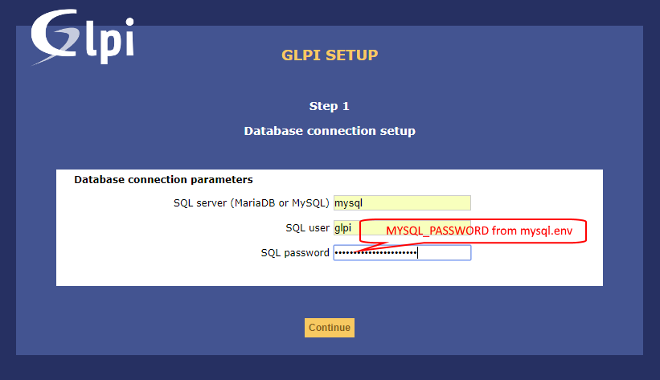

# Проект для запуска GLPI в контейнерах docker

## Устанавливаем и запускаем GLPI instance в docker.
Всего 4 контейнера:  
- для запуска glpi  
- контейнер [mysql:5.7](https://github.com/mysql/mysql-server)
- контейнер для клиента резервного копирования bareos-fd (опционально)
- контейнер с letsencrypt ([linuxserver/letsencrypt](https://github.com/linuxserver/docker-letsencrypt) ) (опционально)
```# docker ps -a  
CONTAINER ID        IMAGE                COMMAND                  CREATED             STATUS                     PORTS                      NAMES  
1b8997776942        glpihostname_glpi    "/opt/entrypoint.sh"     6 minutes ago       Up 6 minutes               192.168.XXX.Х:80->80/tcp   glpi.hostname.ru_glpi  
f3eb793bfbc6        mysql:5.7            "docker-entrypoint.s…"   6 minutes ago       Up 6 minutes               3306/tcp, 33060/tcp        glpi.hostname.ru_mysql  
6e499f87605c        busybox              "sh"                     6 minutes ago       Exited (0) 6 minutes ago                              glpi.hostname.ru_glpi-data  
2a69a6982e6d        busybox              "sh"                     6 minutes ago       Exited (0) 6 minutes ago                              glpi.hostname.ru_mysql-data  
```

Размеры образов
``` # docker images  
REPOSITORY           TAG                 IMAGE ID            CREATED              SIZE  
glpihostname_glpi   latest              b87c1c8ff082        About a minute ago   372MB  
mysql                5.7                 702fb0b7837f        2 weeks ago          372MB  
debian               stretch             be2868bebaba        3 weeks ago          101MB  
busybox              latest              59788edf1f3e        5 weeks ago          1.15MB
```  


### Клонируем проект
```shell
git clone https://github.com/ErshovSergey/glpi_docker-compose.git
```

### Хранение данных
Структура папки
```shell
glpi
   \msmtprc         настройки msmtp для отправки почты, не используется
   \html\           файлы glpi - файлы дистрибутива
   \mysql_data\     файлы MySQL - файлы БД
   \client_bareos   файлы настроек клиента bareos 
```

### 2. Измените настройки
В файле .env укажите необходимые данные.  
Если файла нет то необходимо скопировать .env-default в .env  
Параметры mysql сервера укажите в файле mysql.env.  
Если файла нет то необходимо скопировать mysql.env-default в mysql.env  


### Команды
Посмотреть параметры docker-compose
```shell
docker-compose config
```
Собрать и запустить compomose
```shell
docker-compose up -d --remove-orphans
```
Остановить
```shell
docker-compose down -v
```
Остановить и удалить все контейнеры и образы
```shell
docker-compose down -v --rmi all --remove-orphans
```
Посмотреть состояние  
```shell
docker-compose ps
```
ТОлько glpi
```shell
docker-compose -f docker-compose.yml up -d
```
glpi и bareos-fd
```shell
docker-compose -f docker-compose.yml -f docker-compose.bareos.yml up -d
```
glpi, bareos-fd и letsencrypt+nginx-proxy
используется образ https://hub.docker.com/r/smashwilson/lets-nginx/
```shell
docker-compose -f docker-compose.yml -f docker-compose.bareos.yml -f docker-compose.lets-nginx.yml  --remove-orphans up -d
```

Логи работы glpi  
В файлах 
```
/var/www/html/glpi/files/_log/php-errors.log
/var/www/html/glpi/files/_log/mail.log
/var/www/html/glpi/files/_log/mail-error.log
```
### Дальнейшая настройка производится через браузер.
Настройка доступа mysql 
  
Для подключения к sql серверу указать **mysql**, **glpi** и пароль из **mysql.env**.

### [Интеграция с Active Directory](./doc/GLPI_ActiveDirectory_Authentication_Setting.md)

### Plugins
Расширить функционал можно с помощью плагинов.
#### Установка plugins
[fusioninventory-for-glpi](./doc/plugins_fusioninventory-for-glpi.md) - агент инвентаризации  
[Картографий positions](./doc/plugins_positions.md) - привязка Активов к положению на схеме  
[Network Architecture - archires](./doc/plugins_NetworkArchitecture-archires.md) - Сетевые архитектуры  
[Комплектовка - racks](./doc/plugins_BaysManagement.md) - управоение содержимым стоек
 


# Разобрать!!!
## timelineticket
 https://github.com/pluginsGLPI/timelineticket/releases
wget https://github.com/pluginsGLPI/timelineticket/releases/download/9.2%2B1.0/glpi-timelineticket-9.2.1.0.tar.gz
tar -xzvf glpi-timelineticket-9.2.1.0.tar.gz
mv timelineticket /mnt/sdb/DOCKER_DATA/glpi_glpi.erchov.ru/html/glpi/plugins/

##  accounts
 https://github.com/InfotelGLPI/accounts
wget https://github.com/InfotelGLPI/accounts/releases/download/2.4.0/glpi-accounts-2.4.0.tar.gz
tar -xzvf glpi-accounts-2.3.2.tar.gz
mv accounts /mnt/sdb/DOCKER_DATA/glpi_glpi.erchov.ru/html/glpi/plugins/

## environment
 https://github.com/InfotelGLPI/environment/
wget https://github.com/InfotelGLPI/environment/releases/download/2.2.0/glpi-environment-2.2.0.tar.gz
tar -xzvf glpi-environment-2.1.0.tar.gz
mv environment-master /mnt/sdb/DOCKER_DATA/glpi_glpi.erchov.ru/html/glpi/plugins/
	
## appliances - нет для версии 9.3
 https://forge.glpi-project.org/projects/appliances
wget https://forge.glpi-project.org/attachments/download/2233/glpi-appliances-2.3.2.tar.gz
tar -xzvf glpi-appliances-2.3.2.tar.gz
mv appliances /mnt/sdb/DOCKER_DATA/glpi_glpi.erchov.ru/html/glpi/plugins/


## Восстанавить базу mysql можно командой
cat /var/www/html/glpi.erchov.ru_sql | mysql -h mysql -u root -p


## Update glpi
http://glpi-install.readthedocs.io/en/latest/command-line.html
wget https://github.com/glpi-project/glpi/releases/download/9.3.0/glpi-9.3.tgz
tar zxvf glpi-9.3.tgz -C /mnt/sdb/DOCKER_DATA/glpi_glpi.erchov.ru/html/
chown -R www-data:www-data /mnt/sdb/DOCKER_DATA/glpi_glpi.erchov.ru/html/


для обновления
wget https://github.com/fusioninventory/fusioninventory-for-glpi/archive/glpi9.2+2.0.tar.gz
mv /mnt/sdb/DOCKER_DATA/glpi/html/glpi/plugins/fusioninventory ./fusioninventory.old
tar -xzvf glpi9.2+2.0.tar.gz
mv fusioninventory-for-glpi-glpi9.2-2.0 /mnt/sdb/DOCKER_DATA/glpi/html/glpi/plugins/fusioninventory

##Plugins


wget https://forge.glpi-project.org/attachments/download/2231/glpi-pdf-1.3.1.1.tar.gz
tar -xzvf glpi-pdf-1.3.1.1.tar.gz
mv pdf /mnt/sdb/DOCKER_DATA/glpi/html/glpi/plugins


wget https://github.com/pluginsGLPI/genericobject/archive/master.zip
wget https://github.com/pluginsGLPI/genericobject/archive/2.5.0.tar.gz
mv genericobject-2.5.0 /mnt/sdb/DOCKER_DATA/glpi/html/glpi/plugins/genericobject

wget https://github.com/flegastelois/behaviors/archive/master.zip
unzip master.zip
mv behaviors-master /mnt/sdb/DOCKER_DATA/glpi/html/glpi/plugins/behaviors

wget https://github.com/pluginsGLPI/fields/archive/master.zip
unzip master.zip
mv fields-master /mnt/sdb/DOCKER_DATA/glpi/html/glpi/plugins/fields


Human Resources Management
wget https://github.com/InfotelGLPI/resources/releases/download/2.4.3/glpi-resources-2.4.3.tar.gz
tar -xzvf glpi-resources-2.4.3.tar.gz
mv resources /mnt/sdb/DOCKER_DATA/glpi/html/glpi/plugins/resources

## reports
https://forge.glpi-project.org/projects/reports/files
wget https://forge.glpi-project.org/attachments/download/2246/glpi-plugin-reports-1.11.3.tar.gz
tar -xzf glpi-plugin-reports-1.11.3.tar.gz
mv reports /mnt/sdb/DOCKER_DATA/glpi/html/glpi/plugins/
chown -R www-data:www-data /mnt/sdb/DOCKER_DATA/glpi/html/*


