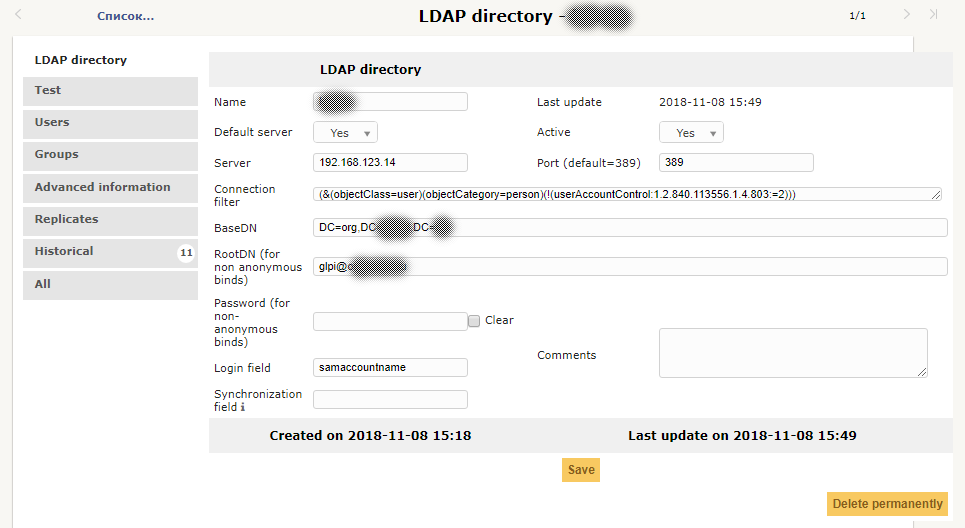
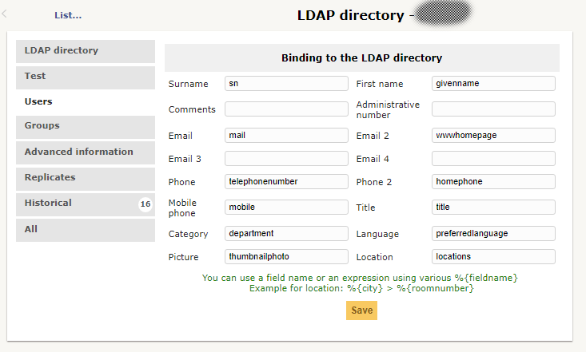

### Интеграция с Active directory (ldap)
#### подключение к Active Directory
**Setup \ Authententifition** 
**LDAP directories**
Добавляем новое подключение, заполняем поля:

Name: имя подключения соединения - произвольно, но так чтобы было понятно что это и зачем

Default server: **yes**  
Active: **yes**  
Server: fqdn-имя вашего контроллера домена или IP (например dc01.Acti.dir), но так не получилось в тесте, получилось только с ip адресом одного из контроллеров.  
Port (default=389): **389**  
Connection filter: **(&(objectClass=user)(objectCategory=person)(!(userAccountControl:1.2.840.113556.1.4.803:=2)))** - этот фильтр будет отображать только активные (включенные) учетные записи  
BaseDN: **DC=DomainName,DC=local** - будет искать по всему домену. Если нужно ограничить область поиска - укажите конкретный OU, например **OU=IT,OU=Users,DC=DomainName,DC=local** (без пробелов)  
RootDN (for non anonymous binds) : **имя пользователя домена с минимальными правами** (правильнее сделать отдельного пользователя со сложным паролем и не включать его ни в какие группы кроме Domain Users, отключить смену пароля по времени или менять одновременно в домене и в glpi)  
Password (for non-anonymous binds): **пароль для вышеописанного пользователя**  
Login field: **samaccountname**  
Сохраните (**Save**) подключение и проведите тестирование кнопкой «**Test**» на вкладе **Test**. Если все ок - можно переходить к следующим шагам.  

#### Настройка импортируемых атрибутов
**Setup \ Authententifition**  
**LDAP directories** вкладка **Users**  
Заполняем поля  

Surname:	**sn**
First name:	**givenname**  
Email:		**mail**  
Email 2:	**wwwhomepage**  
Phone:		**telephonenumber**  
Phone 2:	**homephone**  
Mobile phone:	**mobile**  
Title:		**title**  
Category:	**department**  
Language:	**preferredlanguage**  
Picture:	**thumbnailphoto**  
Location:	**locations**  

### Добавить реплику для использования второго LDAP сервера.

### Импорт пользователей
**Administartion \ Users** 
**LDAP directory link**  
**Import new users**  
Если нужен определенный пользователь - заполняем поля и запускаем поиск - **Search**  
Отмечаем нужного пользователя, **Action\Import**  

Пользователь добавлен, теперь нужно дать ему членство в какой-то группе. 
Открываем свойства пользователя, закладка **Authorizations** - выбираем **Entry** и **Profile**, нажимаем **Add**.

## Авторизация в лесу Active Directory
То же самое, только порт для LDAP 3268.
Авторизация проходит для пользователей не основных доменов.
